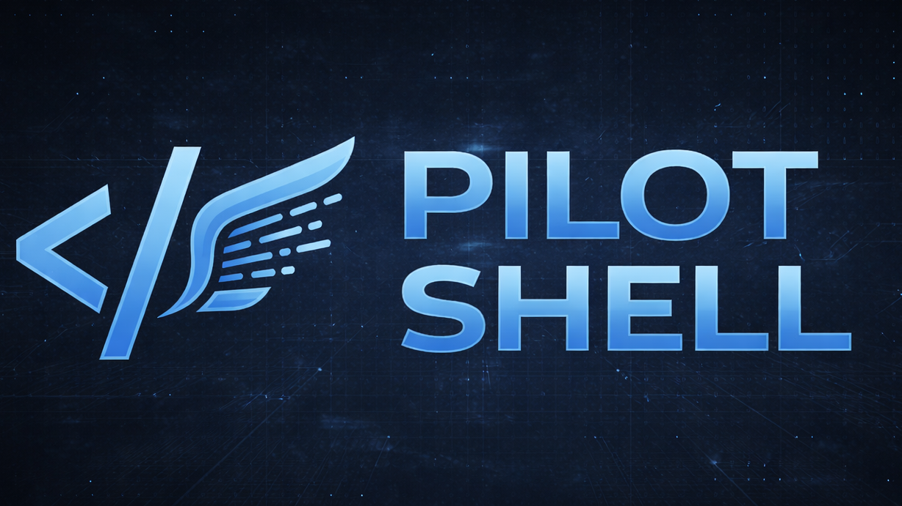

<div align="center">



### Claude Code is powerful. Pilot Shell makes it reliable.

Start a task, grab a coffee, come back to production-grade code.</br>
**Tests enforced. Context preserved. Quality automated.**

[](https://github.com/maxritter/pilot-shell/stargazers)
[](https://star-history.com/#maxritter/pilot-shell&Date)
[](https://github.com/maxritter/pilot-shell/releases)
[](https://github.com/maxritter/pilot-shell/pulls)

⭐ [Star this repo](https://github.com/maxritter/pilot-shell) · 🌐 [Website](https://pilot-shell.com) · 🔔 [Follow for updates](https://www.linkedin.com/in/rittermax/) · 📋 [Changelog](https://pilot.openchangelog.com/) · 📄 [License](LICENSE)

<br>

```bash
curl -fsSL https://raw.githubusercontent.com/maxritter/pilot-shell/main/install.sh | bash
```

**Works on macOS, Linux, and Windows (WSL2).**

</div>

---

## Why I Built This

I'm a senior IT freelancer from Germany. My clients hire me to ship production-quality code — tested, typed, formatted, and reviewed. When something goes into production under my name, quality isn't optional.

Claude Code writes code fast. But without structure, it skips tests, loses context, and produces inconsistent results — especially on complex, established codebases where there are real conventions to follow and real regressions to catch. I tried other frameworks — they burned tokens on bloated prompts without adding real value. Some added process without enforcement. Others were prompt templates that Claude ignored when context got tight. None made Claude reliably produce production-grade code.

So I built Pilot Shell. Instead of adding process on top, it bakes quality into every interaction. Linting, formatting, and type checking run as enforced hooks on every edit. TDD is mandatory, not suggested. Context is monitored and preserved across sessions. Every piece of work goes through verification before it's marked done.

---

## Demo

A full-stack project — created from scratch with a single prompt, then extended with **3 features built in parallel** using `/spec`. Every line of code was planned, implemented, tested, and verified entirely by AI. Zero manual code edits, zero bug fixes by a human.

<div align="center">

<a href="https://youtu.be/S7faAK931NU">
  
</a>

**[Watch the full demo on YouTube](https://youtu.be/S7faAK931NU)** · **[Browse the demo repository](https://github.com/maxritter/pilot-shell-demo)**

</div>

Each `/spec` prompt one-shotted a complete feature — plan, TDD implementation, automated verification, and squash merge — all running simultaneously in isolated git worktrees.

---

## Before & After

| Without Pilot Shell         | With Pilot Shell                                                |
| --------------------------- | --------------------------------------------------------------- |
| Writes code, skips tests    | TDD enforced — RED, GREEN, REFACTOR on every feature            |
| No quality checks           | Hooks auto-lint, format, type-check on every file edit          |
| Context degrades mid-task   | Hooks preserve and restore state across compaction cycles       |
| Every session starts fresh  | Persistent memory across sessions via Pilot Shell Console             |
| Hope it works               | Verifier sub-agents perform code review before marking complete |
| No codebase knowledge       | Production-tested rules loaded into every session               |
| Generic suggestions         | Coding standards activated conditionally by file type           |
| Changes mixed into branch   | Isolated worktrees — review and squash merge when verified      |
| Manual tool setup           | MCP servers + language servers pre-configured and ready         |
| Requires constant oversight | Start a task, grab a coffee, come back to verified results      |

---

## Why This Approach Works

There are other AI coding frameworks out there. I tried them. They add complexity — dozens of agents, elaborate scaffolding, thousands of lines of instruction files — but the output doesn't improve proportionally. More machinery burns more tokens, increases latency, and creates more failure modes. Complexity is not a feature.

**Pilot Shell optimizes for output quality, not system complexity.** The rules are minimal and focused. There's no big learning curve, no project scaffolding to set up, no state files to manage. You install it in any existing project — no matter how complex — run `pilot`, then `/sync` to learn your codebase, and the quality guardrails are just there — hooks, TDD, type checking, formatting — enforced automatically on every edit, in every session.

This isn't a vibe coding tool. It's built for developers who ship to production and need code that actually works. Every rule in the system comes from daily professional use: real bugs caught, real regressions prevented, real sessions where the AI cut corners and the hooks stopped it. The rules are continuously refined based on what measurably improves output.

**The result: you can actually walk away.** Start a `/spec` task, approve the plan, then go grab a coffee. When you come back, the work is done — tested, verified, formatted, and ready to ship. Hooks preserve state across compaction cycles, persistent memory carries context between sessions, quality hooks catch every mistake along the way, and verifier agents review the code before marking it complete. No babysitting required.

The system stays fast because it stays simple. Quick mode is direct execution with zero overhead — no sub-agents, no plan files, no directory scaffolding. You describe the task and it gets done. `/spec` adds structure only when you need it: plan verification, TDD enforcement, independent code review, automated quality checks. Both modes share the same quality hooks. Both modes benefit from persistent memory and hooks that preserve state across compaction.

---

## Getting Started

### Prerequisites

**Claude Subscription:** Solo developers should choose [Max 5x](https://claude.com/pricing) for moderate usage or [Max 20x](https://claude.com/pricing) for heavy usage. Teams and companies should use [Team Premium](https://claude.com/pricing) which provides 6.25x usage per member plus SSO, admin tools, and billing management. Using the API instead may lead to much higher costs.

### Installation

**Works with any existing project.** Pilot Shell doesn't scaffold or restructure your code — it installs alongside your project and adapts to your conventions. `cd` into your project folder, then run:

```bash
curl -fsSL https://raw.githubusercontent.com/maxritter/pilot-shell/main/install.sh | bash
```

**Choose your environment:**

- **Local Installation** — Install directly on your system using Homebrew. Works on macOS, Linux, and Windows (WSL2).
- **Dev Container** — Pre-configured, isolated environment with all tools ready. No system conflicts and works on any OS.

After installation, run `pilot` or `ccp` in your project folder to start Pilot Shell.

<details>
<summary><b>What the installer does</b></summary>

8-step installer with progress tracking, rollback on failure, and idempotent re-runs:

1. **Prerequisites** — Checks Homebrew, Node.js, Python 3.12+, uv, git
2. **Dependencies** — Installs Vexor, playwright-cli, Claude Code, property-based testing tools
3. **Shell integration** — Auto-configures bash, fish, and zsh with `pilot` alias
4. **Config & Claude files** — Sets up `.claude/` plugin, rules, commands, hooks, MCP servers
5. **VS Code extensions** — Installs recommended extensions for your stack
6. **Dev Container** — Auto-setup with all tools pre-configured
7. **Automated updater** — Checks for updates on launch with release notes and one-key upgrade
8. **Cross-platform** — macOS, Linux, Windows (WSL2)

</details>

### Installing a Specific Version

If the current version has issues, you can install a specific stable version (see [releases](https://github.com/maxritter/pilot-shell/releases)):

```bash
export VERSION=6.11.0
curl -fsSL https://raw.githubusercontent.com/maxritter/pilot-shell/main/install.sh | bash
```

### Uninstalling

To completely remove Pilot Shell:

```bash
curl -fsSL https://raw.githubusercontent.com/maxritter/pilot-shell/main/uninstall.sh | bash
```

This removes the Pilot binary, plugin files, managed commands/rules, settings and shell aliases.

---

## How It Works

### /sync — Sync Rules & Standards

Run `/sync` to learn your existing codebase and sync rules with it. Explores your project structure, builds a semantic search index, discovers your conventions and undocumented patterns, updates project documentation, and creates new custom skills. This is how Pilot Shell adapts to your project — not the other way around. Run it once initially, then anytime again:

```bash
pilot
> /sync
```

<details>
<summary><b>What <code>/sync</code> does in detail</b></summary>

| Phase | Action                                                          |
| ----- | --------------------------------------------------------------- |
| 0     | Load reference guidelines, output locations, error handling     |
| 1     | Read existing rules and standards from `.claude/`               |
| 2     | Build Vexor semantic search index (first run may take 5-15 min) |
| 3     | Explore codebase with Vexor/Grep to find patterns               |
| 4     | Compare discovered vs documented patterns                       |
| 5     | Sync/update `project.md` with tech stack and commands           |
| 6     | Sync MCP server documentation                                   |
| 7     | Update existing custom skills that have changed                 |
| 8     | Discover and document new undocumented patterns as rules        |
| 9     | Create new skills via `/learn` command                          |
| 10    | Report summary of all changes                                   |

</details>

### /spec — Spec-Driven Development

Best for features, bug fixes, refactoring, or when you want to review a plan before implementation. Auto-detects whether the task is a feature or bug fix and adapts the planning flow accordingly.

```bash
pilot
> /spec "Add user authentication with OAuth and JWT tokens"
> /spec "Fix the crash when deleting nodes with two children"
```

```
Discuss  →  Plan  →  Approve  →  Implement  →  Verify  →  Done
                                     │              ↑       ↓
                                     │              └─ Loop─┘
                                     ▼
                                  Task 1 (TDD)
                                     ▼
                                  Task 2 (TDD)
                                     ▼
                                  Task 3 (TDD)
```

<details>
<summary><b>Plan Phase</b></summary>

1. Explores entire codebase with semantic search (Vexor)
2. Asks clarifying questions before committing to a design
3. Writes detailed spec to `docs/plans/` as reviewed markdown with scope, tasks, and definition of done
4. **Plan-verifier sub-agent** independently validates completeness and alignment with your request
5. Auto-fixes any issues found by the verifier
6. Waits for your approval — you can edit the plan first

</details>

<details>
<summary><b>Implement Phase</b></summary>

1. Creates an isolated git worktree on a dedicated branch — main branch stays clean
2. Implements each task sequentially with strict TDD (RED → GREEN → REFACTOR)
3. Quality hooks auto-lint, format, and type-check every file edit
4. Runs full test suite after each task to catch regressions early
5. All tasks execute in the main context with full access to hooks and rules

</details>

<details>
<summary><b>Verify Phase</b></summary>

1. Runs full test suite — unit, integration, and E2E
2. Type checking and linting across the entire project
3. Executes actual program to verify real-world behavior (not just tests)
4. **Three review sub-agents** run in parallel: compliance (plan alignment), quality (code standards), and goal (verifies the implementation achieves its intended outcome)
5. Auto-fixes all findings, then re-verifies until clean
6. Loops back to implementation if structural issues remain
7. On success, shows diff summary and offers to squash merge worktree back to main branch

</details>

### Smart Model Routing

Pilot Shell uses the right model for each phase — Opus where reasoning quality matters most, Sonnet where speed and cost matter:

| Phase                 | Default | Why                                                                                                                                               |
| --------------------- | ------- | ------------------------------------------------------------------------------------------------------------------------------------------------- |
| **Planning**          | Opus    | Exploring your codebase, designing architecture, and writing the spec requires deep reasoning. A good plan is the foundation of everything.       |
| **Plan Verification** | Opus    | Catching gaps, missing edge cases, and requirement mismatches before implementation saves expensive rework.                                       |
| **Implementation**    | Sonnet  | With a solid plan, writing code is straightforward. Sonnet is fast, cost-effective, and produces high-quality code when guided by a clear spec.   |
| **Code Verification** | Opus    | Independent code review against the plan requires the same reasoning depth as planning — catching subtle bugs, logic errors, and spec deviations. |

**The insight:** Implementation is the easy part when the plan is good and verification is thorough. Pilot Shell invests reasoning power where it has the highest impact — planning and verification — and uses fast execution where a clear spec makes quality predictable.

**Configurable:** All model assignments are configurable per-component via the Pilot Shell Console settings. Choose between Sonnet 4.6 and Opus 4.6 for the main session, each command, and sub-agents. A global "Extended Context (1M)" toggle enables the 1M token context window across all models simultaneously. **Note:** 1M context models require a Max (20x) or Enterprise subscription — not available to all users.

### Quick Mode

Just chat. No plan file, no approval gate. All quality hooks and TDD enforcement still apply. Best for small tasks, exploration, and quick questions.

```bash
pilot
> Add a loading spinner to the submit button
```

### /learn — Online Learning

Capture non-obvious discoveries as reusable skills. Triggered automatically after 10+ minute investigations, or manually:

```bash
pilot
> /learn "Extract the debugging workflow we used for the race condition"
```

### /vault — Team Vault

Share rules, commands, and skills across your team via a private Git repository:

```bash
pilot
> /vault
```

- **Private** — Use any Git repo (GitHub, GitLab, Bitbucket — public or private)
- **Pull** — Install shared assets from your team's vault
- **Push** — Share your custom rules and skills with teammates
- **Version** — Assets are versioned automatically (v1, v2, v3...)

### Pilot CLI

The `pilot` binary (`~/.pilot/bin/pilot`) manages sessions, worktrees, licensing, and context. Run `pilot` or `ccp` with no arguments to start Claude with Pilot Shell enhancements.

<details>
<summary><b>Session & Context</b></summary>

| Command                               | Purpose                                                              |
| ------------------------------------- | -------------------------------------------------------------------- |
| `pilot`                               | Start Claude with Pilot Shell enhancements, auto-update, and license check |
| `pilot run [args...]`                 | Same as above, with optional flags (e.g., `--skip-update-check`)     |
| `pilot check-context --json`          | Get current context usage percentage                                 |
| `pilot register-plan <path> <status>` | Associate a plan file with the current session                       |
| `pilot sessions [--json]`             | Show count of active Pilot Shell sessions                                  |

</details>

<details>
<summary><b>Worktree Isolation</b></summary>

| Command                                | Purpose                                               |
| -------------------------------------- | ----------------------------------------------------- |
| `pilot worktree create --json <slug>`  | Create isolated git worktree for safe experimentation |
| `pilot worktree detect --json <slug>`  | Check if a worktree already exists                    |
| `pilot worktree diff --json <slug>`    | List changed files in the worktree                    |
| `pilot worktree sync --json <slug>`    | Squash merge worktree changes back to base branch     |
| `pilot worktree cleanup --json <slug>` | Remove worktree and branch when done                  |
| `pilot worktree status --json`         | Show active worktree info for current session         |

</details>

<details>
<summary><b>License & Auth</b></summary>

| Command                        | Purpose                                |
| ------------------------------ | -------------------------------------- |
| `pilot activate <key>`         | Activate a license key on this machine |
| `pilot deactivate`             | Deactivate license on this machine     |
| `pilot status [--json]`        | Show current license status            |
| `pilot verify [--json]`        | Verify license (used by hooks)         |
| `pilot trial --check [--json]` | Check trial eligibility                |
| `pilot trial --start [--json]` | Start a trial                          |

</details>

All commands support `--json` for structured output. Multiple Pilot Shell sessions can run in parallel on the same project — each session tracks its own worktree and context state independently.

### Rules, Commands & Skills

Create your own in your project's `.claude/` folder:

| Type         | Loaded                                       | Best for                               |
| ------------ | -------------------------------------------- | -------------------------------------- |
| **Rules**    | Every session, or conditionally by file type | Guidelines Claude should always follow |
| **Commands** | On demand via `/command`                     | Specific workflows or multi-step tasks |
| **Skills**   | On demand, created via `/learn`              | Reusable knowledge from past sessions  |

Pilot Shell automatically installs best-practice rules, commands, and coding standards. Standards rules use `paths` frontmatter to activate only when you're working with matching file types (e.g., Python standards load only when editing `.py` files). Custom skills are created by `/learn` when it detects non-obvious discoveries, workarounds, or reusable workflows — and can be shared across your team via `/vault`.

### Custom MCP Servers

Add your own MCP servers in `.mcp.json`. Run `/sync` after adding servers to generate documentation.

---

## Under the Hood

### The Hooks Pipeline

**15 hooks** fire automatically across 6 lifecycle events:

#### SessionStart (on startup, clear, or compact)

| Hook                      | Type     | What it does                                                           |
| ------------------------- | -------- | ---------------------------------------------------------------------- |
| Memory loader             | Blocking | Loads persistent context from Pilot Shell Console memory                     |
| `post_compact_restore.py` | Blocking | After auto-compaction: re-injects active plan, task state, and context |
| Session tracker           | Async    | Initializes user message tracking for the session                      |

#### PreToolUse (before search, web, or task tools)

| Hook               | Type     | What it does                                                                                                                             |
| ------------------ | -------- | ---------------------------------------------------------------------------------------------------------------------------------------- |
| `tool_redirect.py` | Blocking | Blocks WebSearch/WebFetch (MCP alternatives exist), EnterPlanMode/ExitPlanMode (/spec conflict). Hints vexor for semantic Grep patterns. |

#### PostToolUse (after every Write / Edit / MultiEdit)

After **every single file edit**, these hooks fire:

| Hook                 | Type         | What it does                                                                                                                                                         |
| -------------------- | ------------ | -------------------------------------------------------------------------------------------------------------------------------------------------------------------- |
| `file_checker.py`    | Blocking     | Dispatches to language-specific checkers: Python (ruff + basedpyright), TypeScript (Prettier + ESLint + tsc), Go (gofmt + golangci-lint). Auto-fixes formatting.     |
| `tdd_enforcer.py`    | Non-blocking | Checks if implementation files were modified without failing tests first. Shows reminder to write tests. Excludes test files, docs, config, TSX, and infrastructure. |
| `context_monitor.py` | Non-blocking | Monitors context usage. Warns at ~80% (informational) and ~90%+ (caution). Prompts `/learn` at key thresholds.                                                       |
| Memory observer      | Async        | Captures development observations to persistent memory.                                                                                                              |

#### PreCompact (before auto-compaction)

| Hook             | Type     | What it does                                                                                             |
| ---------------- | -------- | -------------------------------------------------------------------------------------------------------- |
| `pre_compact.py` | Blocking | Captures Pilot Shell state (active plan, task list, key context) to persistent memory before compaction fires. |

#### Stop (when Claude tries to finish)

| Hook                 | Type     | What it does                                                                                                                               |
| -------------------- | -------- | ------------------------------------------------------------------------------------------------------------------------------------------ |
| `spec_stop_guard.py` | Blocking | If an active spec exists with PENDING or COMPLETE status, **blocks stopping**. Forces verification to complete before the session can end. |
| Session summarizer   | Async    | Saves session observations to persistent memory for future sessions.                                                                       |

#### SessionEnd (when the session closes)

| Hook             | Type     | What it does                                                                                             |
| ---------------- | -------- | -------------------------------------------------------------------------------------------------------- |
| `session_end.py` | Blocking | Stops the worker daemon when no other Pilot Shell sessions are active. Sends real-time dashboard notification. |

### Context Preservation

Pilot Shell preserves context automatically across compaction boundaries:

- `pre_compact.py` captures Pilot Shell state (active plan, tasks, key context) to persistent memory
- `post_compact_restore.py` re-injects Pilot Shell context after compaction — agent continues seamlessly
- Multiple Pilot Shell sessions can run in parallel on the same project without interference
- Status line shows live context usage, memory status, active plan, and license info

**Effective context display:** Claude Code reserves ~16.5% of the context window as a compaction buffer, triggering auto-compaction at ~83.5% raw usage. Pilot Shell rescales this to an **effective 0–100% range** so the status bar fills naturally to 100% right before compaction fires. A `▓` buffer indicator at the end of the bar shows the reserved zone. The context monitor warns at ~80% effective (informational) and ~90%+ effective (caution) — no confusing raw percentages.

### Built-in Rules & Standards

Production-tested best practices loaded into **every session**. These aren't suggestions — they're enforced standards. Coding standards activate conditionally by file type.

<details>
<summary><b>Core Workflow (3 rules)</b></summary>

- `task-and-workflow.md` — Task management, /spec orchestration, deviation handling
- `testing.md` — TDD workflow, test strategy, coverage requirements
- `verification.md` — Execution verification, completion requirements

</details>

<details>
<summary><b>Development Practices (3 rules)</b></summary>

- `development-practices.md` — Project policies, debugging methodology, git rules
- `context-continuation.md` — Auto-compaction and context management protocol
- `pilot-memory.md` — Persistent memory workflow, online learning triggers

</details>

<details>
<summary><b>Tools (3 rules)</b></summary>

- `research-tools.md` — Context7, grep-mcp, web search, GitHub CLI
- `cli-tools.md` — Pilot CLI, Vexor semantic search
- `playwright-cli.md` — Browser automation for E2E UI testing

</details>

<details>
<summary><b>Collaboration (1 rule)</b></summary>

- `team-vault.md` — Team Vault asset sharing via sx

</details>

<details>
<summary><b>Coding Standards (5 standards, activated by file type)</b></summary>

| Standard   | Activates On                                      | Coverage                                                |
| ---------- | ------------------------------------------------- | ------------------------------------------------------- |
| Python     | `*.py`                                            | uv, pytest, ruff, basedpyright, type hints              |
| TypeScript | `*.ts`, `*.tsx`, `*.js`, `*.jsx`                  | npm/pnpm, Jest, ESLint, Prettier, React patterns        |
| Go         | `*.go`                                            | Modules, testing, formatting, error handling            |
| Frontend   | `*.tsx`, `*.jsx`, `*.html`, `*.vue`, `*.css`      | Components, CSS, accessibility, responsive design       |
| Backend    | `**/models/**`, `**/routes/**`, `**/api/**`, etc. | API design, data models, query optimization, migrations |

</details>

### MCP Servers

External context always available to every session:

| Server         | Purpose                                                          |
| -------------- | ---------------------------------------------------------------- |
| **lib-docs**   | Library documentation lookup — get API docs for any dependency   |
| **mem-search** | Persistent memory search — recall context from past sessions     |
| **web-search** | Web search via DuckDuckGo, Bing, and Exa                         |
| **grep-mcp**   | GitHub code search — find real-world usage patterns across repos |
| **web-fetch**  | Web page fetching — read documentation, APIs, references         |

### Language Servers (LSP)

Real-time diagnostics and go-to-definition, auto-installed and configured:

| Language       | Server       | Capabilities                                                                         |
| -------------- | ------------ | ------------------------------------------------------------------------------------ |
| **Python**     | basedpyright | Strict type checking, diagnostics, go-to-definition. Auto-restarts on crash (max 3). |
| **TypeScript** | vtsls        | Full TypeScript support with Vue compatibility. Auto-restarts on crash (max 3).      |
| **Go**         | gopls        | Official Go language server. Auto-restarts on crash (max 3).                         |

All configured via `.lsp.json` with stdio transport.

### Pilot Shell Console

A local web dashboard at `localhost:41777` for monitoring and managing your Pilot Shell sessions.

| View               | What it shows                                                                            |
| ------------------ | ---------------------------------------------------------------------------------------- |
| **Dashboard**      | Workspace status, active sessions, spec progress, git info, recent activity              |
| **Specifications** | All spec plans with task progress, phase tracking, and iteration history                 |
| **Memories**       | Browsable observations — decisions, discoveries, bugfixes — with type filters and search |
| **Sessions**       | Active and past sessions with observation counts and duration                            |
| **Usage**          | Daily token costs, model routing breakdown, and usage trends                             |
| **Vault**          | Shared team assets with version tracking                                                 |
| **Settings**       | Model selection per command/sub-agent, extended context toggle                           |

**Smart Notifications** — Real-time alerts via SSE when Claude needs your input or a spec phase completes.

---

## What Users Say

<!-- Replace with real testimonials from GitHub issues, discussions, or direct feedback as they come in -->

> "I stopped reviewing every line Claude writes. The hooks catch formatting and type errors automatically, TDD catches logic errors, and the spec verifier catches everything else. I review the plan, approve it, and the output is production-grade."

> "Other frameworks I tried added so much overhead that half my tokens went to the system itself. Pilot Shell is lean — quick mode has zero scaffolding, and even /spec only adds structure where it matters. More of my context goes to actual work."

> "The persistent memory changed everything. I can pick up a project after a week and Claude already knows my architecture decisions, the bugs we fixed, and why we chose certain patterns. No more re-explaining the same context every session."

---

## License

Pilot Shell is source-available under a commercial license. See the [LICENSE](LICENSE) file for full terms.

| Tier     | Seats | Includes                                                                     |
| :------- | :---- | :--------------------------------------------------------------------------- |
| **Solo** | 1     | All features, continuous updates, bug reports via [GitHub Issues][gh-issues] |
| **Team** | Multi | Solo + multiple seats, priority email support, feature requests              |

[gh-issues]: https://github.com/maxritter/pilot-shell/issues

Details and licensing at [pilot-shell.com](https://pilot-shell.com).

---

## FAQ

<details>
<summary><b>Does Pilot Shell send my code or data to external services?</b></summary>

**No code, files, prompts, project data, or personal information ever leaves your machine through Pilot Shell.** All development tools — vector search (Vexor), persistent memory (Pilot Shell Console), session state, and quality hooks — run entirely locally.

Pilot Shell makes external calls **only for licensing**. Here is the complete list:

| When                              | Where              | What is sent                       |
| --------------------------------- | ------------------ | ---------------------------------- |
| License validation (once per 24h) | `api.polar.sh`     | License key, organization ID       |
| License activation (once)         | `api.polar.sh`     | License key, machine fingerprint   |
| Trial start (once)                | `pilot-shell.com` | Hashed hardware fingerprint        |

That's it — three calls total, each sent at most once (validation re-checks daily). No OS, no architecture, no Python version, no locale, no analytics, no heartbeats. The validation result is cached locally, and Pilot Shell works fully offline for up to 7 days between checks. Beyond these licensing calls, the only external communication is between Claude Code and Anthropic's API — using your own subscription or API key.

</details>

<details>
<summary><b>Is Pilot Shell enterprise-compliant for data privacy?</b></summary>

Yes. Your source code, project files, and development context never leave your machine through Pilot Shell. The only external calls are license validation (daily, license key only) and one-time activation/trial start (machine fingerprint only). No OS info, no version strings, no analytics, no telemetry. Enterprises using Claude Code with their own API key or Anthropic Enterprise subscription can add Pilot Shell without changing their data compliance posture.

</details>

<details>
<summary><b>What are the licenses of Pilot Shell's dependencies?</b></summary>

All external tools and dependencies that Pilot Shell installs and uses are open source with permissive licenses (MIT, Apache 2.0, BSD). This includes ruff, basedpyright, Prettier, ESLint, gofmt, uv, Vexor, playwright-cli, and all MCP servers. No copyleft or restrictive-licensed dependencies are introduced into your environment.

</details>

<details>
<summary><b>Do I need a separate Anthropic subscription?</b></summary>

Yes. Pilot Shell enhances Claude Code — it doesn't replace it. You need an active Claude subscription — [Max 5x or 20x](https://claude.com/pricing) for solo developers, or [Team Premium](https://claude.com/pricing) for teams and companies. Using the Anthropic API directly is also possible but may lead to much higher costs. Pilot Shell adds quality automation on top of whatever Claude Code access you already have.

</details>

<details>
<summary><b>Does Pilot Shell work with existing projects?</b></summary>

Yes — that's the primary use case. Pilot Shell doesn't scaffold or restructure your code. You install it, run `/sync`, and it explores your codebase to discover your tech stack, conventions, and patterns. From there, every session has full context about your project. The more complex and established your codebase, the more value Pilot Shell adds — quality hooks catch regressions, persistent memory preserves decisions across sessions, and `/spec` plans features against your real architecture.

</details>

<details>
<summary><b>Does Pilot Shell work with any programming language?</b></summary>

Pilot Shell's quality hooks (auto-formatting, linting, type checking) currently support Python, TypeScript/JavaScript, and Go out of the box. TDD enforcement, spec-driven development, persistent memory, context preservation hooks, and all rules and standards work with any language that Claude Code supports. You can add custom hooks for additional languages.

</details>

<details>
<summary><b>Can I use Pilot Shell on multiple projects?</b></summary>

Yes. Pilot Shell installs once and works across all your projects. Each project can have its own `.claude/` rules, custom skills, and MCP servers. Run `/sync` in each project to generate project-specific documentation and standards.

</details>

<details>
<summary><b>Can I add my own rules, commands, and skills?</b></summary>

Yes. Create your own in your project's `.claude/` folder — rules, commands, and skills are all plain markdown files. Your project-level assets are loaded alongside Pilot Shell's built-in defaults and take precedence when they overlap. `/sync` auto-discovers your codebase patterns and generates project-specific rules for you. `/learn` extracts reusable knowledge from sessions into custom skills. Hooks can be extended for additional languages. Use `/vault` to share your custom assets across your team.

</details>

---

## Changelog

See the full changelog at [pilot.openchangelog.com](https://pilot.openchangelog.com/).

---

## Contributing

**Pull Requests** — New features, improvements, and bug fixes are welcome. You can improve Pilot Shell with Pilot Shell — a self-improving loop where your contributions make the tool that makes contributions better.

**Bug Reports** — Found a bug? [Open an issue](https://github.com/maxritter/pilot-shell/issues) on GitHub.

---

<div align="center">

**Claude Code is powerful. Pilot Shell makes it reliable.**

</div>
