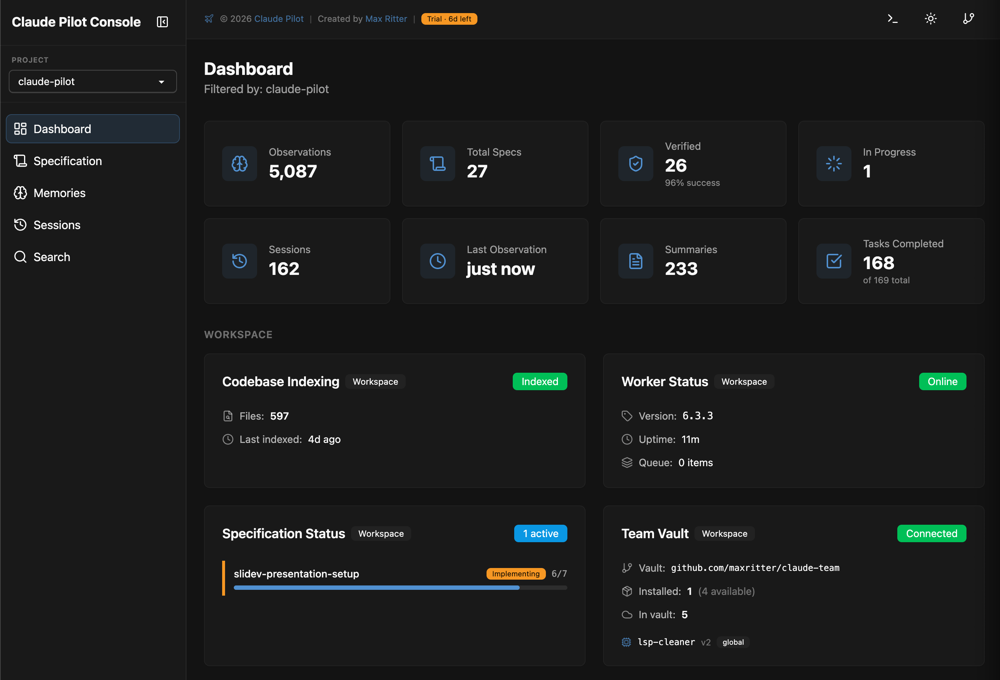

<div align="center">


### Production-Grade Development with Claude Code

Claude Code ships fast but breaks things — Pilot fixes that:</br>
**Tests enforced. Context preserved. Quality automated.**

[](https://github.com/maxritter/claude-pilot/releases)
[](https://www.anthropic.com/claude/opus)
[](https://github.com/maxritter/claude-pilot/stargazers)
[](https://github.com/maxritter/claude-pilot/commits/main)
[](https://github.com/maxritter/claude-pilot/pulls)

[Star this repo](https://github.com/maxritter/claude-pilot) · [Website](https://claude-pilot.com) · [Follow for updates](https://www.linkedin.com/in/rittermax/) · [Changelog](https://pilot.openchangelog.com/) · [License](LICENSE)

<br>


</div>

---

## TL;DR

First, `cd` into your project folder, then run:

```bash
curl -fsSL https://raw.githubusercontent.com/maxritter/claude-pilot/main/install.sh | bash
```

After installation, run `pilot` to launch Claude Pilot. Use `/sync` to load rules and `/spec` for planned features.

---

## Table of Contents

- [The Problem](#the-problem)
- [Getting Started](#getting-started)
- [Usage](#usage)
- [Under the Hood](#under-the-hood)
  - [The Hooks Pipeline](#the-hooks-pipeline)
  - [Context Monitor & Endless Mode](#context-monitor--endless-mode)
  - [21 Built-in Rules](#21-built-in-rules)
  - [14 Built-in Coding Skills](#14-built-in-coding-skills)
  - [5 MCP Servers](#5-mcp-servers)
  - [3 Language Servers (LSP)](#3-language-servers-lsp)
  - [25 Language Modes](#25-language-modes)
- [What's Inside](#whats-inside)
- [Claude Pilot Console](#claude-pilot-console)
- [Before & After](#before--after)
- [License](#license)
- [Changelog](#changelog)
- [Contributing](#contributing)

---

## The Problem

Claude Code writes code fast. But without structure, you get:

- **No tests** — Code ships without verification
- **Context decay** — Quality degrades as the context window fills
- **Session amnesia** — Every restart, you re-explain everything
- **Inconsistent results** — Same prompt, different outcomes

Sound familiar? Pilot fixes that with **21 rules, 7 automated hooks, 14 coding skills, 3 language servers, and 5 MCP servers** working together on every single edit.

---

## Getting Started

### Prerequisites

**Claude Subscription:** [Max](https://www.anthropic.com/max), [Team](https://claude.ai/pricing/team), or [Enterprise](https://www.anthropic.com/enterprise) recommended

**Choose your environment:**
- **Local Installation** — Install directly on your system using Homebrew. Works on macOS, Linux, and Windows (WSL2).
- **Dev Container** — Pre-configured, isolated environment with all tools ready. No system conflicts and works on any OS.

### Installation

`cd` into your project folder, then run:

```bash
curl -fsSL https://raw.githubusercontent.com/maxritter/claude-pilot/main/install.sh | bash
```

After installation, run `pilot` or `ccp` in your project folder to start Claude Pilot.

### Installing a Specific Version

If the current version has issues, you can install a specific stable version (see [releases](https://github.com/maxritter/claude-pilot/releases)):

```bash
export VERSION=6.2.0
curl -fsSL https://raw.githubusercontent.com/maxritter/claude-pilot/main/install.sh | bash
```

---

## Usage

### Sync Rules & Skills

Run `/sync` to sync custom rules and skills with your codebase. This is an **11-phase process** that explores your codebase, builds a semantic search index, discovers undocumented patterns, updates project documentation, creates new skills, and optionally shares assets via Team Vault. Run it once initially, then anytime again:

```bash
pilot
> /sync
```

<details>
<summary><b>What <code>/sync</code> does in detail (11 phases)</b></summary>

| Phase | Action |
|-------|--------|
| 0 | Load reference guidelines, output locations, error handling |
| 1 | Read existing rules and skills from `.claude/` |
| 2 | Build Vexor semantic search index (first run may take 5-15 min) |
| 3 | Explore codebase with Vexor/Grep to find patterns |
| 4 | Compare discovered vs documented patterns |
| 5 | Sync/update `project.md` with tech stack and commands |
| 6 | Sync MCP server documentation |
| 7 | Update existing skills that have changed |
| 8 | Discover and document new undocumented patterns as rules |
| 9 | Create new skills via `/learn` command |
| 10 | Share new assets via Team Vault (sx) |
| 11 | Report summary of all changes |

</details>

### Spec-Driven Mode

Best for complex features, refactoring, or when you want to review a plan before implementation:

```bash
pilot
> /spec "Add user authentication with OAuth and JWT tokens"
```

**How it works:**

```
Plan  →  Approve  →  Implement  →  Verify
                        ↑              ↓
                        └── Loop ──────┘
```

<details>
<summary><b>Plan Phase — what actually happens</b></summary>

1. Explores entire codebase with semantic search (Vexor)
2. Asks clarifying questions before committing to a design
3. Writes detailed spec to `docs/plans/` as reviewed markdown
4. Verifies plan logic for correctness before presenting
5. Waits for your approval — you can edit the plan first

</details>

<details>
<summary><b>Implement Phase — what actually happens</b></summary>

1. Writes a failing test first (RED phase of TDD)
2. Implements code to make the test pass (GREEN phase)
3. Refactors while keeping tests green (REFACTOR phase)
4. Quality hooks auto-lint, format, and type-check every file edit
5. Updates plan checkboxes after each completed task
6. If context reaches 70%+, hands off to next session seamlessly

</details>

<details>
<summary><b>Verify Phase — what actually happens</b></summary>

1. Runs full test suite — unit, integration, and E2E
2. Type checking across the entire project
3. **Verifier sub-agents** perform independent code review
4. Validates every plan task was actually completed
5. Loops back to implementation if any check fails

</details>

**Status-based dispatch** — running `/spec` on an existing plan automatically resumes at the right phase:

| Plan Status | Approved? | Action |
|-------------|-----------|--------|
| PENDING | No | Run planning |
| PENDING | Yes | Run implementation |
| COMPLETE | * | Run verification |
| VERIFIED | * | Done |

### Quick Mode

Just chat. No plan file, no approval gate. All quality hooks and TDD enforcement still apply.

Best for bug fixes, small improvements, and exploratory work:

```bash
pilot
> Fix the null pointer bug in user.py
```

### Online Learning

Capture non-obvious discoveries as reusable skills. Triggered automatically after 10+ minute investigations, or manually:

```bash
pilot
> /learn "Extract the debugging workflow we used for the race condition"
```

**What triggers learning:**
- Non-obvious debugging (10+ minutes of investigation)
- Misleading error messages with discovered workarounds
- Tool integrations and configurations
- Repeatable workflows and patterns
- External service queries (Jira, GitHub, Confluence)

### Rules, Commands & Skills

Create your own rules, commands or skills in your project's `.claude/` folder:

| Type         | Loaded                            | Best for                                |
| ------------ | --------------------------------- | --------------------------------------- |
| **Rules**    | Every session (always in context) | Guidelines Claude should always follow  |
| **Commands** | On demand via `/command`          | Specific workflows or multi-step tasks  |
| **Skills**   | Dynamically when relevant         | Specialized knowledge for specific tasks |

Claude Pilot automatically installs best-practice rules, commands, and coding standard skills.

### Team Vault

Share rules, commands, and skills across your team via a private Git repository:

```bash
pilot
> /sync  # Configure team vault and sync assets
```

- **Private** - Use any Git repo (GitHub, GitLab, Bitbucket - public or private)
- **Pull** - Install shared assets from your team's vault
- **Push** - Share your custom rules and skills with teammates
- **Version** - Assets are versioned automatically (v1, v2, v3...)

### Custom MCP Servers

Add your own MCP servers in two locations:

| Config File | How It Works | Best For |
|-------------|--------------|----------|
| `.mcp.json` | Instructions load into context when triggered | Lightweight servers (few tools) |
| `mcp_servers.json` | Called via mcp-cli; instructions never enter context | Heavy servers (many tools) |

Run `/sync` after adding servers to generate documentation.

---

## Under the Hood

Pilot isn't a thin wrapper or a prompt template — it's a deeply engineered system with layers of automation working together on every edit.

### The Hooks Pipeline

**7 hooks** fire automatically at every stage of development. Here's what runs and when:

#### SessionStart (on startup, clear, or compact)

| Hook | Type | What it does |
|------|------|-------------|
| Memory loader | Blocking | Loads persistent context from Pilot Console memory |
| Session tracker | Async | Initializes user message tracking for the session |

#### PostToolUse (after every Write / Edit / MultiEdit)

This is where most of the quality enforcement happens. After **every single file edit**, these hooks fire:

| Hook | Type | What it does |
|------|------|-------------|
| `file_checker_python.py` | Blocking | Runs ruff format + lint + basedpyright type checking on `.py` files. Auto-fixes formatting and common lint issues. |
| `file_checker_ts.py` | Blocking | Runs Prettier + ESLint + type checking on `.ts`/`.tsx` files. Auto-fixes formatting and common issues. |
| `file_checker_go.py` | Blocking | Runs gofmt + golangci-lint + type checking on `.go` files. Auto-fixes formatting. |
| `tdd_enforcer.py` | Non-blocking | Checks if implementation files were modified without failing tests first. Shows reminder to write tests. Excludes test files, docs, config, TSX, and infrastructure. |
| Memory observer | Async | Captures development observations to persistent memory. |
| `context_monitor.py` | Non-blocking | Monitors context window usage. Warns at 80%, forces handoff at 90%, emergency at 95%. Caches for 15 seconds to avoid spam. |

#### PreToolUse (before search, web, or task tools)

| Hook | Type | What it does |
|------|------|-------------|
| `tool_redirect.py` | Blocking | Routes WebSearch, WebFetch, Grep, Task, and plan mode tools to appropriate contexts. Prevents tools from being accidentally lost during plan/implement phases. |

#### Stop (when Claude tries to finish)

| Hook | Type | What it does |
|------|------|-------------|
| `spec_stop_guard.py` | Blocking | If an active spec exists with PENDING or COMPLETE status, **blocks stopping**. Forces verification to complete before the session can end. |
| Session summarizer | Async | Saves session observations to persistent memory for future sessions. |

### Context Monitor & Endless Mode

The context monitor tracks usage in real-time and manages multi-session continuity:

| Threshold | Level | Action |
|-----------|-------|--------|
| **80%** | WARN | Prepare for continuation. Pilot saves state, wraps up current work, prepares handoff notes. |
| **90%** | CRITICAL | Mandatory handoff. Saves session state to `~/.pilot/sessions/`, writes continuation file, picks up seamlessly in new session. |
| **95%** | URGENT | Emergency handoff. All progress preserved — no work lost. |

**Key behaviors:**
- At 70%+ during `/spec`, Pilot won't start a new phase — it hands off to the next session
- Multiple Pilot sessions can run in parallel on the same project without interference
- Session state is stored in `~/.pilot/sessions/$PILOT_SESSION_ID/`
- 15-second TTL cache prevents repeated warnings from flooding output

### 21 Built-in Rules

2,800+ lines of best practices loaded into **every session**. These aren't suggestions — they're enforced standards:

<details>
<summary><b>Quality Enforcement (4 rules)</b></summary>

- `tdd-enforcement.md` — Mandatory RED → GREEN → REFACTOR cycle with verification checklist
- `verification-before-completion.md` — Never mark task complete without full verification
- `execution-verification.md` — How to verify code actually works (run it, test it, smoke test it)
- `workflow-enforcement.md` — Systematic approach to problem-solving

</details>

<details>
<summary><b>Context Management (3 rules)</b></summary>

- `context-continuation.md` — Endless Mode protocol (thresholds, handoff format, multi-session parallel)
- `memory.md` — 3-layer persistent memory workflow (search → timeline → observations)
- `coding-standards.md` — General naming, organization, documentation, performance

</details>

<details>
<summary><b>Language Standards (3 rules)</b></summary>

- `python-rules.md` — uv for packages, pytest for testing, ruff for linting, basedpyright for types
- `typescript-rules.md` — npm/pnpm, Jest, ESLint, Prettier, React component patterns
- `golang-rules.md` — Go modules, testing conventions, code organization, common patterns

</details>

<details>
<summary><b>Tool Integration (6 rules)</b></summary>

- `vexor-search.md` — Semantic code search: indexing, querying, token-efficient retrieval
- `context7-docs.md` — Library documentation: fetching API docs for any dependency
- `grep-mcp.md` — GitHub code search: finding real-world usage patterns across repos
- `web-search.md` — Web search via DuckDuckGo, Bing, Exa with query syntax and filtering
- `agent-browser.md` — Headless browser for E2E UI testing with page navigation and screenshots
- `mcp-cli.md` — MCP command line: listing servers, running tools, custom configuration

</details>

<details>
<summary><b>Development Workflow (5 rules)</b></summary>

- `git-operations.md` — Commit messages, branching strategy, PR workflow
- `gh-cli.md` — GitHub CLI: issues, PRs, releases, code search
- `systematic-debugging.md` — Root cause analysis, hypothesis testing, minimal reproducible examples
- `testing-strategies-coverage.md` — Unit vs integration vs E2E, coverage metrics, mock strategies
- `learn.md` — Online learning system: when and how to extract knowledge into skills

</details>

### 14 Built-in Coding Skills

Dynamically activated when relevant — specialized knowledge loaded on demand instead of consuming context permanently:

| Skill | Coverage |
|-------|----------|
| Python Standards | uv, pytest, ruff, basedpyright, type hints, docstrings |
| TypeScript Standards | npm/pnpm, Jest, ESLint, Prettier, React patterns |
| Go Standards | Modules, testing, formatting, error handling |
| Testing Patterns | Unit testing, integration testing, mocking, coverage goals |
| Test Organization | File structure, naming conventions, fixtures, setup |
| API Design | RESTful patterns, response envelopes, error handling, versioning |
| Data Models | Database schemas, type safety, migrations, relationships |
| Components | Reusable patterns, props design, documentation, testing |
| CSS / Styling | Naming conventions, organization, responsive design, performance |
| Responsive Design | Mobile-first, breakpoints, Flexbox/Grid, touch interactions |
| Design System | Color palette, typography, spacing, component consistency |
| Accessibility | WCAG compliance, ARIA attributes, keyboard nav, screen readers |
| DB Migrations | Schema changes, data transformation, rollback strategy |
| Query Optimization | Indexing, N+1 problems, query patterns, performance |

### 5 MCP Servers

External context always available to every session:

| Server | Purpose |
|--------|---------|
| **Context7** | Library documentation lookup — get API docs for any dependency |
| **mem-search** | Persistent memory search — recall context from past sessions |
| **web-search** | Web search via DuckDuckGo, Bing, and Exa |
| **grep-mcp** | GitHub code search — find real-world usage patterns across repos |
| **web-fetch** | Web page fetching — read documentation, APIs, references |

### 3 Language Servers (LSP)

Real-time diagnostics and go-to-definition, auto-installed and configured:

| Language | Server | Capabilities |
|----------|--------|-------------|
| **Python** | basedpyright | Strict type checking, diagnostics, go-to-definition. Auto-restarts on crash (max 3). |
| **TypeScript** | vtsls | Full TypeScript support with Vue compatibility. Auto-restarts on crash (max 3). |
| **Go** | gopls | Official Go language server. Auto-restarts on crash (max 3). |

All configured via `.lsp.json` with stdio transport.

### 25 Language Modes

Pilot speaks your language. Available localizations:

English, Arabic, Bengali, Czech, German, Spanish, French, Hindi, Indonesian, Italian, Japanese, Korean, Malay, Dutch, Polish, Portuguese (BR), Portuguese (PT), Romanian, Russian, Swedish, Thai, Turkish, Ukrainian, Vietnamese, Chinese — plus a "chill" mode.

---

## What's Inside

### Endless Mode

- **Context monitor** with 80% / 90% / 95% thresholds and automatic action at each level
- **Automatic session handoff** with state preservation to `~/.pilot/sessions/`
- **Multi-session parallel** — run multiple Pilot sessions in the same project without interference
- **Persistent memory** bridges observations across all sessions via Pilot Console

### Spec-Driven Development

- **Plan** — Semantic search, clarifying questions, markdown spec to `docs/plans/`
- **Approve** — Human review gate before any code is written, editable plan
- **Implement** — Mandatory TDD with RED → GREEN → REFACTOR, quality hooks on every edit
- **Verify** — Sub-agent code review, full test suite, loops back if any check fails

### Quality Automation

- **TDD enforcer** — Warns when modifying implementation files without a failing test
- **Python hooks** — ruff format + lint + basedpyright type checking on every `.py` edit
- **TypeScript hooks** — Prettier + ESLint + vtsls type checking on every `.ts`/`.tsx` edit
- **Go hooks** — gofmt + golangci-lint + gopls type checking on every `.go` edit
- **Spec stop guard** — Blocks session completion when verification is incomplete
- **Context monitor** — Tracks context usage and manages session continuity

### Modular Rules, Commands & Skills

- **21 rules** (2,800+ lines) — TDD, debugging, context management, language standards, tool integration
- **6 commands** — `/spec` (SDD), `/sync` (11-phase sync), `/learn` (online learning), plus internal phases
- **14 skills** — Coding standards for Python, TypeScript, Go, testing, API, components, CSS, accessibility, and more
- **Customizable** — Add your own rules, commands, and skills that survive updates

### Enhanced Context Capabilities

- **Pilot Console** at localhost:41777 — visual dashboard for observations, search, session management
- **Persistent memory** with semantic search (Vexor) across all sessions
- **Context7** library docs + **grep-mcp** GitHub code search + **web search/fetch** MCP tools
- **Agent browser** — headless browser for E2E UI testing with screenshots
- **3 language servers** (basedpyright, vtsls, gopls) for real-time diagnostics

### One-Command Installer

- **Dev Container** auto-setup with all tools pre-configured
- **Extended language support** — Python, TypeScript & Go with linters, formatters, type checkers
- **Automated updater** — Updates Pilot to the latest version when launched
- **Shell integration** — Auto-configures bash, fish, and zsh with `pilot` alias (and `ccp` for migration)
- **Cross-platform** — macOS, Linux, Windows (WSL2)

### Team Vault

- **Private Git repo** for shared rules, commands, and skills across your team
- **Pull/Push** — Install shared assets or share your own with teammates
- **Automatic versioning** — Assets are versioned (v1, v2, v3...) on every push
- **Works everywhere** — GitHub, GitLab, Bitbucket (public or private repos)

### Online Learning

- **Automatic extraction** of non-obvious debugging patterns after 10+ minute investigations
- **Captures workarounds**, misleading error messages, tool integrations
- **Creates `.claude/skills/`** with proper frontmatter and quality gates
- **Reusability verification** — Content must be useful beyond the current session

---

## Claude Pilot Console

Access the web-based Claude Pilot Console at **http://localhost:41777** to visualize your development workflow:



**Features:**
- Real-time observation stream (bugfix, feature, refactor, discovery, decision, change)
- Session management and context usage display
- Full-text and semantic search across all observations
- Memory status and license information
- Filter by project, date range, or observation type

---

## Before & After

| Without Pilot | With Pilot |
| ------------- | ---------- |
| Writes code, skips tests | TDD enforced — RED, GREEN, REFACTOR on every feature |
| No quality checks | 7 hooks auto-lint, format, type-check on every file edit |
| Context degrades mid-task | Endless Mode with 80%/90%/95% thresholds and auto-handoff |
| Every session starts fresh | Persistent memory across sessions via Pilot Console |
| Hope it works | Verifier sub-agents perform code review before marking complete |
| No codebase knowledge | 21 rules (2,800+ lines) loaded into every session |
| Generic suggestions | 14 coding skills activated dynamically when relevant |
| Manual tool setup | 5 MCP servers + 3 LSP servers pre-configured and ready |

---

## License

Claude Pilot is source-available under a commercial license. See the [LICENSE](LICENSE) file for full terms.

| Tier | Includes |
|:-----|:---------|
| **Trial** | All features for 7 days, no credit card required |
| **Standard** ($14/mo) | All features, continuous updates, GitHub support |
| **Enterprise** ($35/mo) | Standard + dedicated email support and priority feature requests |

Details and licensing at [license.claude-pilot.com](https://license.claude-pilot.com).

---

## Changelog

See the full changelog at [pilot.openchangelog.com](https://pilot.openchangelog.com/).

---

## Contributing

**Pull Requests** - New features, improvements, and bug fixes are welcome. Fun fact: Pilot is built with Pilot — a self-improving loop where your contributions make the tool that makes contributions better.

**Issues** - Found a bug or have a feature request? [Open an issue](https://github.com/maxritter/claude-pilot/issues).


